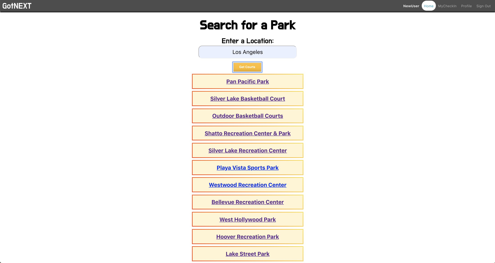
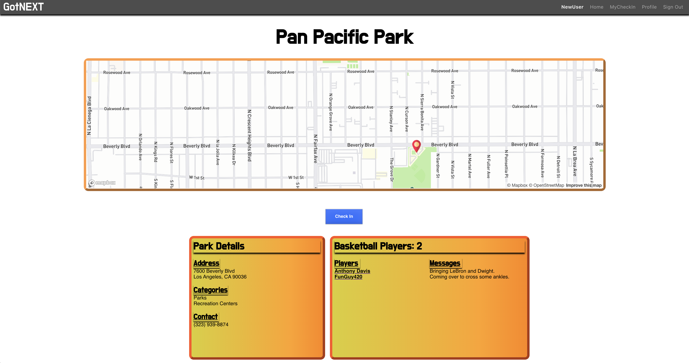

# GotNext

## An app to find basketball players at various parks

## Inspiration
Growing up, I would go to outdoor parks to play basketball with my friends and sometimes, we would see other players out on the courts but at other times, the courts would be empty. A lot of the times we would find ourselves with an odd number of players or not enough to get a full 5 on 5 going which is what made me think about creating this app! 

### Technologies used: React, Node, Express, Firebase (Authentication, Firestore, Storage), Mapbox API, Yelp API

### User Story
- User creates an account
- Sets up a profile including picture , fav sports, social links
- Find courts based off input location
- Select a court out of the 20 a list renders
- Court show page displays details of the court including an interactive map
- Users can check in and out of a court and see if players are playing there or not in real time

